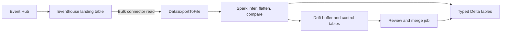
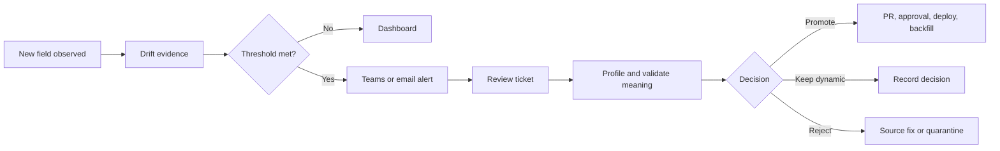

# Eventhouse Schema Drift Reference

This repository is a customer demo and implementation guide for handling evolving IoT JSON directly in Microsoft Fabric Eventhouse. It shows how to replace recurring Spark schema-inference and flattening notebooks with native KQL processing while preserving new fields safely.

All names and data are synthetic. Validate the pattern with representative production volume before adoption.

## Start With Today's Spark Journey

Many telemetry implementations follow this path:

1. Data first lands in Eventhouse.
2. A Spark notebook reads it back through the Kusto connector.
3. Spark infers the JSON schema, flattens fields, detects changes, and writes Delta tables.
4. New fields trigger buffering, schema comparison, approval, and another merge job.



This works, but it is less efficient because data leaves the engine that already stores and queries it. Every scheduled notebook adds Spark startup, bulk export, schema inference, watermark, buffer, and merge work. Concurrent connector reads can also compete for export capacity. The architecture is solving a data-shape problem with repeated data movement.

## What This Demo Proves

The demo builds the following replacement entirely inside Eventhouse:


- `RawTelemetry` keeps the original message as a replay point.
- Stored KQL functions cast approved fields into predictable columns.
- Update policies run those functions automatically when data arrives.
- Unknown fields remain in `ResidualTelemetry` rather than breaking ingestion.
- A second policy records new field names, types, samples, and first/last-seen evidence.
- Arrays become stable child rows with `mv-expand`.
- Approved fields are promoted with metadata commands and a bounded backfill.

Routine telemetry no longer needs a Spark export. Spark or a pipeline can remain as a small control-plane tool for reviewed DDL automation, external calls, or work genuinely outside KQL.

## The Four KQL Techniques To Learn

### 1. Preserve evolving JSON with `DropMappedFields`

Known routing fields become physical columns while the rest of the document remains available in `RawRecord`:

```kusto
{"Column":"MessageId", "Properties":{"Path":"$.id"}},
{"Column":"SourceType", "Properties":{"Path":"$.sourceType"}},
{"Column":"RawRecord", "Properties":{"Path":"$", "Transform":"DropMappedFields"}}
```

**Why it matters:** a producer can add a field without changing the landing-table schema or losing the new value.

### 2. Keep the target schema fixed with explicit projection and `bag_remove_keys()`

```kusto
| extend Telemetry = todynamic(RawRecord.payload.telemetry)
| project
		MessageId,
		ControllerStatus=tostring(Telemetry.controllerStatus),
		EngineHours=toreal(Telemetry.engineHours),
		ResidualTelemetry=bag_remove_keys(
				Telemetry,
				dynamic(['controllerStatus', 'engineHours', 'fuelConsumption']))
```

**Why it matters:** only named columns reach the typed table. Any new key stays in the residual bag, so the function's output shape does not change.

### 3. Run the transform automatically with an update policy

```kusto
.alter table ControllerTelemetry policy update
```
```json
[{"IsEnabled":true,
	"Source":"RawTelemetry",
	"Query":"TransformControllerTelemetry()",
	"IsTransactional":false}]
```

**Why it matters:** Eventhouse transforms each newly ingested batch without a scheduled Spark read. With `IsTransactional:false`, raw ingestion survives a target failure and operators replay from `RawTelemetry` after repair.

### 4. Turn unknown keys and arrays into rows

```kusto
| mv-expand FieldName = bag_keys(Telemetry) to typeof(string)
| where not(set_has_element(KnownKeys, FieldName))
```

```kusto
| mv-expand Zone = Zones
```

**Why it matters:** the first expression creates evidence for every unknown field; the second normalizes a variable array without creating runtime-generated columns.

## Step-By-Step Demo Journey

| Step | Run | Show the customer | Main benefit |
|---|---|---|---|
| 1 | [Landing table](kql/01-landing-table.kql) | Physical routing columns plus flexible `RawRecord` | Raw data remains recoverable |
| 2 | [JSON mapping](kql/02-json-mapping.kql) | `DropMappedFields` captures everything not already mapped | New JSON fields are retained automatically |
| 3 | [Target tables](kql/03-target-tables.kql) | Stable reporting tables and residual safety-net columns | Consumers get predictable schemas |
| 4 | [Transform functions](kql/04-flatten-functions.kql) | Explicit casts, `bag_remove_keys()`, and `mv-expand` | KQL replaces routine Spark flattening |
| 5 | [Update policies](kql/05-update-policies.kql) and [drift policy](kql/06-drift-log.kql) | Ingestion automatically fills typed tables and drift evidence | No scheduled bulk export |
| 6 | [Synthetic ingestion](kql/10-ingest-samples.kql) and [smoke tests](tests/deployed-smoke-tests.kql) | Normal fields, new fields, a type conflict, two zones, and an empty array | The audience sees the pattern survive real drift cases |
| 7 | [Promotion and backfill](kql/07-promotion-backfill.kql) | Add an approved column, revise the function, validate, and replay a bounded period | Schema evolution becomes controlled metadata work |

Use the [presenter demo script](docs/demo-script.md) for narration, expected results, questions to ask, and recovery notes.

## Follow One Message Through The Demo

Use this controller message from [samples/telemetry.jsonl](samples/telemetry.jsonl) as the story throughout the demonstration. The producer has added `serviceCountdownHours` without coordinating a target-table change:

```json
{
	"id": "10000000-0000-0000-0000-000000000002",
	"timestamp": "2026-01-15T10:00:01Z",
	"sourceType": "controller",
	"schemaVersion": 2,
	"payload": {
		"telemetry": {
			"controllerStatus": "running",
			"engineHours": 1251.0,
			"fuelConsumption": 8.2,
			"serviceCountdownHours": 120
		}
	}
}
```

### Step 1: The mapping preserves the payload

The stable envelope becomes physical columns. After `DropMappedFields`, `RawRecord` still contains the payload, including the new field:

```text
MessageId      10000000-0000-0000-0000-000000000002
SourceType     controller
SchemaVersion  2
RawRecord      {"payload":{"telemetry":{...,"serviceCountdownHours":120}}}
```

Nothing is rejected and no landing-table column is added.

### Step 2: The transform creates a predictable typed row

The approved fields are explicitly cast. `bag_remove_keys()` places the unapproved field in the residual bag:

```text
ControllerStatus  EngineHours  FuelConsumption  ResidualTelemetry
running           1251.0       8.2              {"serviceCountdownHours":120}
```

The typed schema is unchanged, so existing dashboards and queries continue to work.

### Step 3: The update policies produce two outcomes

The controller policy writes the typed row above. In parallel, the drift policy uses `bag_keys()`, `mv-expand`, `set_has_element()`, and `gettype()` to write evidence:

```text
SourceType  FieldPath             ObservedType  SampleValue
controller  serviceCountdownHours long          120
```

This replaces the routine Spark schema comparison: the new field is preserved, processing continues, and reviewers receive concrete evidence.

### Step 4: Review and promote the field

After confirming that the field is consistently numeric and has agreed business meaning, [07-promotion-backfill.kql](kql/07-promotion-backfill.kql) adds `ServiceCountdownHours:real` and revises the transform. New rows, and bounded replay rows, then look like this:

```text
ControllerStatus  EngineHours  FuelConsumption  ServiceCountdownHours  ResidualTelemetry
running           1251.0       8.2              120.0                  {}
```

The value moved from flexible JSON into the governed schema without rebuilding the raw ingestion path.

### A concrete array example

The cooling-unit fixture contains zones `1` and `2`. `mv-expand Zone=Zones` turns that single parent message into two stable child rows:

```text
DeviceId    ZoneId  OperatingMode  ReturnAirTemperature  SetpointTemperature
cooling-01  1       cool           2.8                   2.0
cooling-01  2       defrost        5.1                   4.0
```

When the next fixture contains `"zones":[]`, it produces zero child rows rather than a variable set of columns.

## Production Alert, Review, and Promotion

Detection should be automatic; schema changes should not be. In production, an unknown field follows this operating path:



For the concrete `serviceCountdownHours` example, an alert can require at least 10 observations in 15 minutes. It sends the source, field path, observed types, sample value, affected assets, and first/last-seen times to a Teams channel and creates one review ticket for that source/field combination.

| Role | What they do |
|---|---|
| Data operations | Acknowledge the alert and verify ingestion and update-policy health |
| Source-system owner | Confirm whether the field and type were intentionally released |
| Domain owner | Define meaning, unit, range, sensitivity, retention, and ownership |
| Data engineer | Profile values and recommend promote, keep dynamic, reject, or source fix |
| Platform engineer | Implement tested DDL, function revision, monitoring, and bounded backfill |
| Consumer owner and approver | Validate compatibility and authorize the production change |

See the [full alert, review, and promotion runbook](docs/alert-review-promotion.md) for the notification payload, review query, approval checklist, and alternate decisions.

## Engineer Real-Time Dashboard

The [dashboard and alert query pack](kql/11-dashboard-alert-queries.kql) provides standalone KQL for a Fabric Real-Time Dashboard:

| Dashboard tile | What the engineer learns |
|---|---|
| Ingestion rate | Whether every source is still sending messages |
| Raw-to-target completeness | Whether update policies are keeping up or need replay |
| New drift fields | Field, types, sample, frequency, and affected assets for triage |
| Drift trend | Whether a firmware or API release caused a spike |
| Conversion failures | Existing fields whose values no longer match the approved type |
| Residual backlog | Fields still awaiting a governance decision |
| Zone amplification | Child-row growth caused by variable arrays |

The same query pack includes a medium-severity new-field alert and a high-severity raw-to-target gap alert. Dashboard refresh and alert evaluation are independent: alerts continue running when nobody has the dashboard open.

## Safety Model

The demo policies use `IsTransactional:false`. A failed transform therefore does not roll back ingestion into `RawTelemetry`, but the corresponding target can miss rows until operators detect and replay the failure. Microsoft generally recommends transactional policies for production consistency. Choose deliberately after testing the failure and replay model.

## Demo Setup

Prerequisites:

- A Microsoft Fabric workspace with an Eventhouse and editable KQL database.
- Database Admin permission for table, function, policy, and materialized-view commands.
- A test database. The scripts create fixed demo objects.

Run the demonstration files in order:

1. `kql/01-landing-table.kql`
2. `kql/02-json-mapping.kql`
3. `kql/03-target-tables.kql`
4. `kql/04-flatten-functions.kql`
5. `kql/05-update-policies.kql`
6. `kql/06-drift-log.kql`
7. `kql/10-ingest-samples.kql`

Then run `tests/deployed-smoke-tests.kql`.

Create the optional engineer dashboard by adding each standalone section from `kql/11-dashboard-alert-queries.kql` as a tile. Configure its two `ALERT` sections in Fabric Activator, Logic Apps, or the organization's monitoring platform.

Allow approximately 25 minutes for the technical demo and 15 minutes for architecture, production risks, and questions.

## Repository Guide

- `kql/`: ordered deployment and operations modules.
- `samples/`: synthetic JSON Lines fixtures.
- `tests/`: pure-query checks and deployed smoke tests.
- `docs/`: architecture, customization, migration, and operational guidance.
- `presentation/`: generated customer presentation and reproducible source.

The [customer presentation](presentation/eventhouse-schema-drift-reference.pptx) and [target architecture image](docs/images/target-architecture.png) are generated by `presentation/build_presentation.py`.

## Important Boundaries

- Unknown keys are retained, not automatically promoted.
- Existing-key type changes are observable but require an explicit compatibility decision.
- `cooling_unit` arrays become one row per zone; the original zone identifier is retained.
- Cross-row deduplication belongs in a materialized view or query layer, not an update policy.
- OneLake availability is optional and applies to ordinary tables. Its batching latency must be validated for each consumer.

See [Architecture](docs/architecture.md) for the end-to-end flow and [Customization Guide](docs/customization-guide.md) before adapting this sample.

## Microsoft Learn References

- [Update policy overview](https://learn.microsoft.com/kusto/management/update-policy?view=microsoft-fabric)
- [Ingestion mappings and DropMappedFields](https://learn.microsoft.com/kusto/management/mappings?view=microsoft-fabric)
- [bag_remove_keys()](https://learn.microsoft.com/kusto/query/bag-remove-keys-function?view=microsoft-fabric)
- [mv-expand operator](https://learn.microsoft.com/kusto/query/mv-expand-operator?view=microsoft-fabric)
- [Create materialized views](https://learn.microsoft.com/kusto/management/materialized-views/materialized-view-create?view=microsoft-fabric)
- [OneLake availability](https://learn.microsoft.com/fabric/real-time-intelligence/event-house-onelake-availability)
