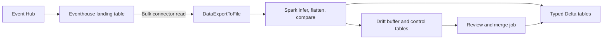
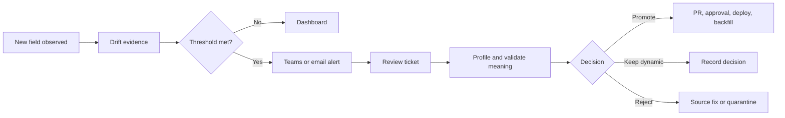

# Eventhouse Schema Drift Reference

JSON changes over time. A device firmware adds a measurement, an API starts returning a nested object, or one producer sends a number as text. Those changes are normal. The difficulty is accepting them without losing data, breaking reports, or allowing every incoming property to become a production column automatically.

This repository presents one way to handle that problem in Microsoft Fabric Eventhouse. It applies whether data arrives from Event Hubs, Fabric event streams, an SDK, files, or another ingestion path. It also applies whether the current transformation layer uses Spark, pipelines, application code, or no separate processing engine at all.

The central idea is simple: keep the original message, publish a stable view of the fields the business already understands, and hold unfamiliar fields for review. KQL performs those steps as data arrives. People still decide which fields become part of the governed schema.

All names and data are synthetic. Validate the pattern with representative production volume before adoption.

## How To Read This Guide

You do not need to read every file to understand the pattern.

- **New to schema drift:** read *What Counts as Schema Drift?*, *The Five Principles*, and *One Message, End to End*.
- **Designing a production process:** read the [alert, review, and promotion runbook](docs/alert-review-promotion.md), then the limitations and migration guides under `docs/`.
- **Ready to try the implementation:** go to *Deploy the Sample* and run the KQL files in order.

## Who This Is For

This reference is useful when:

- producers can release JSON changes independently of the analytics team;
- reports, APIs, or OneLake consumers need predictable columns;
- new data must not be discarded while its meaning is being reviewed;
- engineers need to see drift soon after it starts;
- schema changes require an owner, tests, and an approval trail.

The examples use telemetry, but the same pattern works for application events, audit records, partner feeds, and other semi-structured JSON.

## First, What Counts As Schema Drift?

Schema drift means the shape or type of incoming data differs from the contract the receiving system currently understands. Not all drift has the same risk.

| Change | Example | What can go wrong |
|---|---|---|
| A field is added | `serviceCountdownHours: 120` | The value is silently dropped or forces an urgent table change |
| A known field changes type | `signalStrength: "unknown"` instead of `18` | A cast returns null or downstream calculations fail |
| A field disappears | `engineHours` is omitted | Consumers may mistake missing data for zero or a valid value |
| An object changes shape | `modem` gains nested properties | Flattening logic creates unstable columns or misses data |
| An array changes length | A unit reports zero, two, or five zones | Fixed `Zone1`, `Zone2` columns stop representing the source |

This implementation handles added fields and changing arrays directly. It preserves evidence for type conflicts and missing values, but their business treatment still needs an explicit rule. No technical pattern can infer whether `"unknown"` should mean null, an error, or a new business state.

## The Five Principles

### 1. Keep an untouched recovery point

Store enough of the original message to investigate and replay it later. If a conversion rule is wrong, the raw row lets the team fix the rule and process that time range again. Without the raw value, a failed cast may be impossible to recover.

In this repository, that recovery point is `RawTelemetry.RawRecord`.

### 2. Separate the input shape from the consumer contract

Incoming JSON is flexible; reporting tables should not be. A target table contains only fields with agreed names, meanings, and types. Adding an input property therefore changes the data we received, not the table contract consumers depend on.

This is why the solution does not automatically add a column for every JSON key.

### 3. Preserve what is not understood yet

Unknown does not mean invalid. An unfamiliar property is stored in a dynamic residual bag beside the typed columns. Existing queries can ignore it, while engineers and domain owners still have the value available for investigation.

Here, those holding areas are `ResidualTelemetry` and `ResidualZone`.

### 4. Detect drift separately from processing normal data

Known fields should continue flowing even when a new field appears. A separate drift path records the new field name, observed type, sample value, and timestamps. This gives the review process evidence without pausing every message behind an approval step.

Operational failures and schema discoveries are different events. A raw-to-target gap is an incident; a safely preserved new field is usually a governance task.

### 5. Promote fields deliberately

A field becomes a physical column only after somebody confirms its meaning, unit, type, ownership, usefulness, and historical backfill requirement. Promotion is a reviewed code and metadata change, not a side effect of ingestion.

These five principles are more important than the exact table names or sample domain. When adapting the repository, preserve these boundaries even if the surrounding architecture changes.

## How The Pieces Fit Together

The reference implementation uses one raw table and a few independent paths:

1. The ingestion mapping extracts stable envelope values such as message ID, event time, and source type.
2. The rest of the JSON stays in `RawRecord`.
3. Stored KQL functions read approved values, cast them, and write ordinary typed tables.
4. Unknown values stay in residual dynamic columns.
5. Another function records drift observations for the dashboard and alerting process.
6. Array items are expanded into child rows rather than changing the parent schema.


An **update policy** is the Eventhouse mechanism connecting these steps. When rows arrive in `RawTelemetry`, a policy runs a stored function and writes its fixed output to a target table. Several policies can read the same raw rows: one for controller data, one for gateway data, one for zones, and one for drift observations. They do not need to run in a particular order because each target is independent.

The typed tables are the normal interface for reports and applications. `RawTelemetry` and residual bags are the recovery and investigation layers. `TelemetryDriftObservations` is the operational review layer.

## Terms Used In This Repository

| Term | Meaning here |
|---|---|
| Raw table | The first durable Eventhouse table. It retains the incoming message for investigation and replay. |
| Typed table | A table with named columns and types that reports, APIs, and other consumers can depend on. |
| `dynamic` | Kusto's type for values such as JSON objects and arrays whose internal shape may vary. |
| Residual bag | A `dynamic` object containing fields that arrived but are not part of the approved typed contract. |
| Stored function | Named KQL that reads raw rows and returns the exact columns expected by a target table. |
| Update policy | Eventhouse configuration that runs a query when new rows are ingested and writes the result to another table. |
| Drift observation | Evidence that an unfamiliar field arrived: its path, observed type, sample value, and timestamps. |
| Promotion | The reviewed change that gives a useful field a physical typed column. |
| Backfill | Reprocessing a bounded period of raw history after a transformation or schema change. |

## One Migration Scenario: Spark Export Processing

The pattern does not require Spark to be present. However, one common starting architecture reads data back out of Eventhouse to infer and flatten each batch:



There is nothing inherently wrong with those Spark operations. The opportunity is narrower: if Spark only performs routine JSON parsing, routing, schema comparison, and flattening, those steps can often move into Eventhouse. Work that needs Spark, external libraries, or Lakehouse-scale processing can stay where it is.

## The KQL That Makes It Work

The next sections connect each principle to its KQL implementation. New readers may prefer to read [One Message, End to End](#one-message-end-to-end) first, then return here for the syntax.

### Keep the rest of the message

Known routing fields become physical columns while the rest of the document remains available in `RawRecord`:

```kusto
{"Column":"MessageId", "Properties":{"Path":"$.id"}},
{"Column":"SourceType", "Properties":{"Path":"$.sourceType"}},
{"Column":"RawRecord", "Properties":{"Path":"$", "Transform":"DropMappedFields"}}
```

`DropMappedFields` removes the envelope values already mapped to columns and leaves the rest in `RawRecord`. Adding a property at the source does not require a landing-table change.

### Be explicit about the typed contract

```kusto
| extend Telemetry = todynamic(RawRecord.payload.telemetry)
| project
		MessageId,
		ControllerStatus=tostring(Telemetry.controllerStatus),
		EngineHours=toreal(Telemetry.engineHours),
		ResidualTelemetry=bag_remove_keys(
				Telemetry,
				dynamic(['controllerStatus', 'engineHours', 'fuelConsumption']))
```

Only the named columns reach the typed table. `bag_remove_keys()` takes those approved names out of the telemetry bag; whatever remains is stored in `ResidualTelemetry`. This is what keeps the function output stable when the input changes.

### Run the function as data arrives

```kusto
.alter table ControllerTelemetry policy update
```
```json
[{"IsEnabled":true,
	"Source":"RawTelemetry",
	"Query":"TransformControllerTelemetry()",
	"IsTransactional":false}]
```

The update policy removes the need for a scheduled connector read. This sample uses `IsTransactional:false`, so a target failure does not reject the raw message. That choice requires monitoring and replay, which are covered later in the repository.

### Turn changing structures into rows

```kusto
| mv-expand FieldName = bag_keys(Telemetry) to typeof(string)
| where not(set_has_element(KnownKeys, FieldName))
```

```kusto
| mv-expand Zone = Zones
```

The first expression creates one observation for each unrecognized field name. The second creates one child row per array item. Neither operation invents columns at runtime.

## Implementation Walkthrough

Run the files in numeric order. Here is what each stop is for:

| Stop | Files | What to look at |
|---|---|---|
| Land the message | [01](kql/01-landing-table.kql), [02](kql/02-json-mapping.kql) | Stable envelope columns and the remaining JSON in `RawRecord` |
| Define the contract | [03](kql/03-target-tables.kql), [04](kql/04-flatten-functions.kql) | Explicit casts, residual bags, and zone expansion |
| Wire up ingestion | [05](kql/05-update-policies.kql), [06](kql/06-drift-log.kql) | One raw message feeding typed and drift tables |
| Load the examples | [10](kql/10-ingest-samples.kql), [smoke tests](tests/deployed-smoke-tests.kql) | A new field, a type conflict, two zones, and an empty array |
| Promote a field | [07](kql/07-promotion-backfill.kql) | The table change, revised function, schema check, and bounded replay |

## One Message, End to End

The easiest way to understand the pattern is to follow a single controller message from [samples/telemetry.jsonl](samples/telemetry.jsonl). It contains a field the target table has never seen before: `serviceCountdownHours`.

```json
{
	"id": "10000000-0000-0000-0000-000000000002",
	"timestamp": "2026-01-15T10:00:01Z",
	"sourceType": "controller",
	"schemaVersion": 2,
	"payload": {
		"telemetry": {
			"controllerStatus": "running",
			"engineHours": 1251.0,
			"fuelConsumption": 8.2,
			"serviceCountdownHours": 120
		}
	}
}
```

### It lands intact

The stable envelope becomes physical columns. After `DropMappedFields`, `RawRecord` still contains the payload, including the new field:

```text
MessageId      10000000-0000-0000-0000-000000000002
SourceType     controller
SchemaVersion  2
RawRecord      {"payload":{"telemetry":{...,"serviceCountdownHours":120}}}
```

No row is rejected, and the landing table does not need a new column.

### Known fields go to the typed table

The approved fields are explicitly cast. `bag_remove_keys()` places the unapproved field in the residual bag:

```text
ControllerStatus  EngineHours  FuelConsumption  ResidualTelemetry
running           1251.0       8.2              {"serviceCountdownHours":120}
```

The table shape has not changed, so existing queries keep working. The new value is still there if somebody needs it.

### Drift is recorded separately

The controller policy writes the typed row above. In parallel, the drift policy uses `bag_keys()`, `mv-expand`, `set_has_element()`, and `gettype()` to write evidence:

```text
SourceType  FieldPath             ObservedType  SampleValue
controller  serviceCountdownHours long          120
```

At this point normal processing has continued, and the review queue has a field name, type, sample value, and timestamp to work with.

### The team can promote it later

After confirming that the field is consistently numeric and has agreed business meaning, [07-promotion-backfill.kql](kql/07-promotion-backfill.kql) adds `ServiceCountdownHours:real` and revises the transform. New rows, and bounded replay rows, then look like this:

```text
ControllerStatus  EngineHours  FuelConsumption  ServiceCountdownHours  ResidualTelemetry
running           1251.0       8.2              120.0                  {}
```

The value has moved from flexible JSON into the typed contract. The raw ingestion path did not have to be rebuilt.

### Arrays follow the same idea

The cooling-unit fixture contains zones `1` and `2`. `mv-expand Zone=Zones` turns that single parent message into two stable child rows:

```text
DeviceId    ZoneId  OperatingMode  ReturnAirTemperature  SetpointTemperature
cooling-01  1       cool           2.8                   2.0
cooling-01  2       defrost        5.1                   4.0
```

When the next fixture contains `"zones":[]`, it produces zero child rows rather than a variable set of columns.

## Production Alert, Review, and Promotion

Detection should be automatic; schema changes should not be. In production, an unknown field follows this operating path:



For the concrete `serviceCountdownHours` example, an alert can require at least 10 observations in 15 minutes. It sends the source, field path, observed types, sample value, affected assets, and first/last-seen times to a Teams channel and creates one review ticket for that source/field combination.

| Role | What they do |
|---|---|
| Data operations | Acknowledge the alert and verify ingestion and update-policy health |
| Source-system owner | Confirm whether the field and type were intentionally released |
| Domain owner | Define meaning, unit, range, sensitivity, retention, and ownership |
| Data engineer | Profile values and recommend promote, keep dynamic, reject, or source fix |
| Platform engineer | Implement tested DDL, function revision, monitoring, and bounded backfill |
| Consumer owner and approver | Validate compatibility and authorize the production change |

See the [full alert, review, and promotion runbook](docs/alert-review-promotion.md) for the notification payload, review query, approval checklist, and alternate decisions.

## Engineer Real-Time Dashboard

The [dashboard and alert query pack](kql/11-dashboard-alert-queries.kql) provides standalone KQL for a Fabric Real-Time Dashboard:

| Dashboard tile | What the engineer learns |
|---|---|
| Ingestion rate | Whether every source is still sending messages |
| Raw-to-target completeness | Whether update policies are keeping up or need replay |
| New drift fields | Field, types, sample, frequency, and affected assets for triage |
| Drift trend | Whether a firmware or API release caused a spike |
| Conversion failures | Existing fields whose values no longer match the approved type |
| Residual backlog | Fields still awaiting a governance decision |
| Zone amplification | Child-row growth caused by variable arrays |

The same query pack includes a medium-severity new-field alert and a high-severity raw-to-target gap alert. Dashboard refresh and alert evaluation are independent: alerts continue running when nobody has the dashboard open.

The tiles share four Fabric Real-Time Dashboard parameters:

- the built-in `_startTime` and `_endTime` time range;
- `_sourceType` for one or more source families;
- `_assetId` for one or more assets;
- `_fieldPath` for drift and data-quality fields.

The three value filters are multi-select parameters with **Select all** enabled. See the [dashboard parameter setup](docs/alert-review-promotion.md#dashboard-parameters) for their exact definitions and query-based value lists. The included synthetic events are dated January 15, 2026, so the dashboard time picker must include that date when testing this sample.

## Safety Model

The sample policies use `IsTransactional:false`. A failed transform therefore does not roll back ingestion into `RawTelemetry`, but the corresponding target can miss rows until operators detect and replay the failure. Microsoft generally recommends transactional policies for production consistency. Choose deliberately after testing the failure and replay model.

## Deploy the Sample

Prerequisites:

- A Microsoft Fabric workspace with an Eventhouse and editable KQL database.
- Database Admin permission for table, function, policy, and materialized-view commands.
- A test database. The scripts create fixed sample objects.

Run these files in order:

1. `kql/01-landing-table.kql`
2. `kql/02-json-mapping.kql`
3. `kql/03-target-tables.kql`
4. `kql/04-flatten-functions.kql`
5. `kql/05-update-policies.kql`
6. `kql/06-drift-log.kql`
7. `kql/10-ingest-samples.kql`

Then run `tests/deployed-smoke-tests.kql`.

Create the optional engineer dashboard by adding each standalone section from `kql/11-dashboard-alert-queries.kql` as a tile. Configure its two `ALERT` sections in Fabric Activator, Logic Apps, or the organization's monitoring platform.

## Repository Guide

- `kql/`: ordered deployment and operations modules.
- `samples/`: synthetic JSON Lines fixtures.
- `tests/`: pure-query checks and deployed smoke tests.
- `docs/`: architecture, customization, migration, and operational guidance.
- `presentation/`: optional local deck generator and reproducible source.

The [target architecture image](docs/images/target-architecture.png) is generated by `presentation/build_presentation.py`. The same script can create a local PowerPoint deck, but generated `.pptx` files are intentionally excluded from this repository.

## Important Boundaries

- Unknown keys are retained, not automatically promoted.
- Existing-key type changes are observable but require an explicit compatibility decision.
- `cooling_unit` arrays become one row per zone; the original zone identifier is retained.
- Cross-row deduplication belongs in a materialized view or query layer, not an update policy.
- OneLake availability is optional and applies to ordinary tables. Its batching latency must be validated for each consumer.

See [Architecture](docs/architecture.md) for the end-to-end flow and [Customization Guide](docs/customization-guide.md) before adapting this sample.

## Microsoft Learn References

- [Update policy overview](https://learn.microsoft.com/kusto/management/update-policy?view=microsoft-fabric)
- [Ingestion mappings and DropMappedFields](https://learn.microsoft.com/kusto/management/mappings?view=microsoft-fabric)
- [bag_remove_keys()](https://learn.microsoft.com/kusto/query/bag-remove-keys-function?view=microsoft-fabric)
- [mv-expand operator](https://learn.microsoft.com/kusto/query/mv-expand-operator?view=microsoft-fabric)
- [Create materialized views](https://learn.microsoft.com/kusto/management/materialized-views/materialized-view-create?view=microsoft-fabric)
- [OneLake availability](https://learn.microsoft.com/fabric/real-time-intelligence/event-house-onelake-availability)
