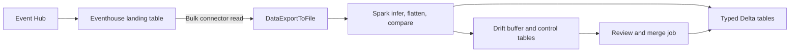
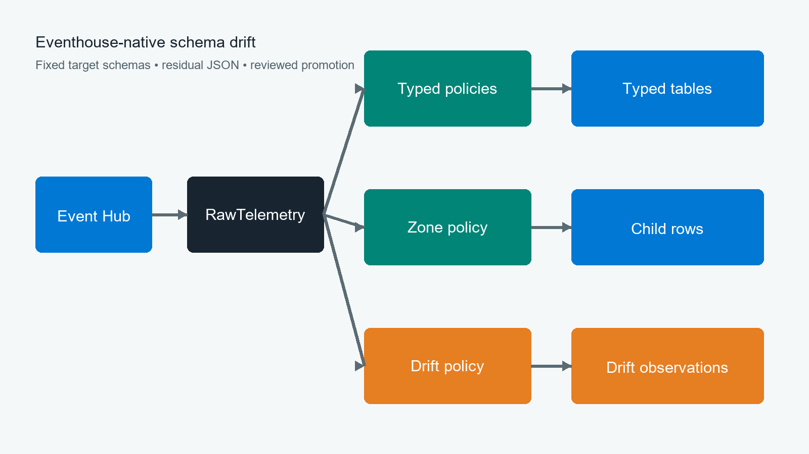
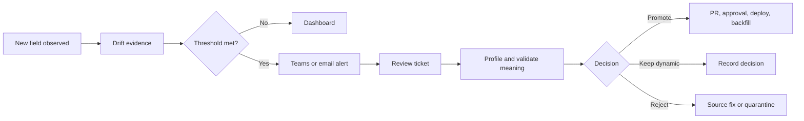

# Eventhouse Schema Drift Reference

This repository grew out of a common telemetry problem: JSON payloads change, but the tables used by reports and APIs cannot change every time a device firmware does.

The example keeps that work in Microsoft Fabric Eventhouse. KQL handles the routine parsing, routing, and drift detection. Spark is still available for jobs that need it, but it is no longer in the path simply to flatten each batch.

All names and data are synthetic. Validate the pattern with representative production volume before adoption.

## The Starting Point

The design we wanted to simplify looked like this:

1. Data first lands in Eventhouse.
2. A Spark notebook reads it back through the Kusto connector.
3. Spark infers the JSON schema, flattens fields, detects changes, and writes Delta tables.
4. New fields trigger buffering, schema comparison, approval, and another merge job.



There is nothing inherently wrong with those Spark operations. The awkward part is that the data has already landed in Eventhouse, then leaves again for work KQL can do during ingestion. At scale, that means Spark startup time, connector exports, watermarks, buffers, and merge jobs all have to be operated. Concurrent reads can also compete for export capacity.

## The Eventhouse Approach

The reference implementation uses one raw table and a small set of update policies:



- `RawTelemetry` holds the original message and gives us somewhere to replay from.
- Stored functions cast the fields we know into stable columns.
- Update policies call those functions as data arrives.
- Fields we do not know yet stay in `ResidualTelemetry`; they are not discarded.
- A separate policy records enough evidence to review the new field later.
- Repeating arrays, such as cooling zones, are written as child rows.

The result is a deliberately boring contract for downstream consumers. A device can add a property without forcing an immediate table change. When a field is useful and understood, the team promotes it through a normal reviewed change.

## The KQL That Makes It Work

### Keep the rest of the message

Known routing fields become physical columns while the rest of the document remains available in `RawRecord`:

```kusto
{"Column":"MessageId", "Properties":{"Path":"$.id"}},
{"Column":"SourceType", "Properties":{"Path":"$.sourceType"}},
{"Column":"RawRecord", "Properties":{"Path":"$", "Transform":"DropMappedFields"}}
```

`DropMappedFields` removes the envelope values already mapped to columns and leaves the rest in `RawRecord`. Adding a property at the source does not require a landing-table change.

### Be explicit about the typed contract

```kusto
| extend Telemetry = todynamic(RawRecord.payload.telemetry)
| project
		MessageId,
		ControllerStatus=tostring(Telemetry.controllerStatus),
		EngineHours=toreal(Telemetry.engineHours),
		ResidualTelemetry=bag_remove_keys(
				Telemetry,
				dynamic(['controllerStatus', 'engineHours', 'fuelConsumption']))
```

Only the named columns reach the typed table. `bag_remove_keys()` takes those approved names out of the telemetry bag; whatever remains is stored in `ResidualTelemetry`. This is what keeps the function output stable when the input changes.

### Run the function as data arrives

```kusto
.alter table ControllerTelemetry policy update
```
```json
[{"IsEnabled":true,
	"Source":"RawTelemetry",
	"Query":"TransformControllerTelemetry()",
	"IsTransactional":false}]
```

The update policy removes the need for a scheduled connector read. This sample uses `IsTransactional:false`, so a target failure does not reject the raw message. That choice requires monitoring and replay, which are covered later in the repository.

### Turn changing structures into rows

```kusto
| mv-expand FieldName = bag_keys(Telemetry) to typeof(string)
| where not(set_has_element(KnownKeys, FieldName))
```

```kusto
| mv-expand Zone = Zones
```

The first expression creates one observation for each unrecognized field name. The second creates one child row per array item. Neither operation invents columns at runtime.

## Running the Demo

Run the files in numeric order. Here is what each stop is for:

| Stop | Files | What to look at |
|---|---|---|
| Land the message | [01](kql/01-landing-table.kql), [02](kql/02-json-mapping.kql) | Stable envelope columns and the remaining JSON in `RawRecord` |
| Define the contract | [03](kql/03-target-tables.kql), [04](kql/04-flatten-functions.kql) | Explicit casts, residual bags, and zone expansion |
| Wire up ingestion | [05](kql/05-update-policies.kql), [06](kql/06-drift-log.kql) | One raw message feeding typed and drift tables |
| Try the examples | [10](kql/10-ingest-samples.kql), [smoke tests](tests/deployed-smoke-tests.kql) | A new field, a type conflict, two zones, and an empty array |
| Promote a field | [07](kql/07-promotion-backfill.kql) | The table change, revised function, schema check, and bounded replay |

Use the [presenter demo script](docs/demo-script.md) for narration, expected results, questions to ask, and recovery notes.

## One Message, End to End

The easiest way to understand the pattern is to follow a single controller message from [samples/telemetry.jsonl](samples/telemetry.jsonl). It contains a field the target table has never seen before: `serviceCountdownHours`.

```json
{
	"id": "10000000-0000-0000-0000-000000000002",
	"timestamp": "2026-01-15T10:00:01Z",
	"sourceType": "controller",
	"schemaVersion": 2,
	"payload": {
		"telemetry": {
			"controllerStatus": "running",
			"engineHours": 1251.0,
			"fuelConsumption": 8.2,
			"serviceCountdownHours": 120
		}
	}
}
```

### It lands intact

The stable envelope becomes physical columns. After `DropMappedFields`, `RawRecord` still contains the payload, including the new field:

```text
MessageId      10000000-0000-0000-0000-000000000002
SourceType     controller
SchemaVersion  2
RawRecord      {"payload":{"telemetry":{...,"serviceCountdownHours":120}}}
```

No row is rejected, and the landing table does not need a new column.

### Known fields go to the typed table

The approved fields are explicitly cast. `bag_remove_keys()` places the unapproved field in the residual bag:

```text
ControllerStatus  EngineHours  FuelConsumption  ResidualTelemetry
running           1251.0       8.2              {"serviceCountdownHours":120}
```

The table shape has not changed, so existing queries keep working. The new value is still there if somebody needs it.

### Drift is recorded separately

The controller policy writes the typed row above. In parallel, the drift policy uses `bag_keys()`, `mv-expand`, `set_has_element()`, and `gettype()` to write evidence:

```text
SourceType  FieldPath             ObservedType  SampleValue
controller  serviceCountdownHours long          120
```

At this point normal processing has continued, and the review queue has a field name, type, sample value, and timestamp to work with.

### The team can promote it later

After confirming that the field is consistently numeric and has agreed business meaning, [07-promotion-backfill.kql](kql/07-promotion-backfill.kql) adds `ServiceCountdownHours:real` and revises the transform. New rows, and bounded replay rows, then look like this:

```text
ControllerStatus  EngineHours  FuelConsumption  ServiceCountdownHours  ResidualTelemetry
running           1251.0       8.2              120.0                  {}
```

The value has moved from flexible JSON into the typed contract. The raw ingestion path did not have to be rebuilt.

### Arrays follow the same idea

The cooling-unit fixture contains zones `1` and `2`. `mv-expand Zone=Zones` turns that single parent message into two stable child rows:

```text
DeviceId    ZoneId  OperatingMode  ReturnAirTemperature  SetpointTemperature
cooling-01  1       cool           2.8                   2.0
cooling-01  2       defrost        5.1                   4.0
```

When the next fixture contains `"zones":[]`, it produces zero child rows rather than a variable set of columns.

## Production Alert, Review, and Promotion

Detection should be automatic; schema changes should not be. In production, an unknown field follows this operating path:



For the concrete `serviceCountdownHours` example, an alert can require at least 10 observations in 15 minutes. It sends the source, field path, observed types, sample value, affected assets, and first/last-seen times to a Teams channel and creates one review ticket for that source/field combination.

| Role | What they do |
|---|---|
| Data operations | Acknowledge the alert and verify ingestion and update-policy health |
| Source-system owner | Confirm whether the field and type were intentionally released |
| Domain owner | Define meaning, unit, range, sensitivity, retention, and ownership |
| Data engineer | Profile values and recommend promote, keep dynamic, reject, or source fix |
| Platform engineer | Implement tested DDL, function revision, monitoring, and bounded backfill |
| Consumer owner and approver | Validate compatibility and authorize the production change |

See the [full alert, review, and promotion runbook](docs/alert-review-promotion.md) for the notification payload, review query, approval checklist, and alternate decisions.

## Engineer Real-Time Dashboard

The [dashboard and alert query pack](kql/11-dashboard-alert-queries.kql) provides standalone KQL for a Fabric Real-Time Dashboard:

| Dashboard tile | What the engineer learns |
|---|---|
| Ingestion rate | Whether every source is still sending messages |
| Raw-to-target completeness | Whether update policies are keeping up or need replay |
| New drift fields | Field, types, sample, frequency, and affected assets for triage |
| Drift trend | Whether a firmware or API release caused a spike |
| Conversion failures | Existing fields whose values no longer match the approved type |
| Residual backlog | Fields still awaiting a governance decision |
| Zone amplification | Child-row growth caused by variable arrays |

The same query pack includes a medium-severity new-field alert and a high-severity raw-to-target gap alert. Dashboard refresh and alert evaluation are independent: alerts continue running when nobody has the dashboard open.

## Safety Model

The demo policies use `IsTransactional:false`. A failed transform therefore does not roll back ingestion into `RawTelemetry`, but the corresponding target can miss rows until operators detect and replay the failure. Microsoft generally recommends transactional policies for production consistency. Choose deliberately after testing the failure and replay model.

## Demo Setup

Prerequisites:

- A Microsoft Fabric workspace with an Eventhouse and editable KQL database.
- Database Admin permission for table, function, policy, and materialized-view commands.
- A test database. The scripts create fixed demo objects.

Run the demonstration files in order:

1. `kql/01-landing-table.kql`
2. `kql/02-json-mapping.kql`
3. `kql/03-target-tables.kql`
4. `kql/04-flatten-functions.kql`
5. `kql/05-update-policies.kql`
6. `kql/06-drift-log.kql`
7. `kql/10-ingest-samples.kql`

Then run `tests/deployed-smoke-tests.kql`.

Create the optional engineer dashboard by adding each standalone section from `kql/11-dashboard-alert-queries.kql` as a tile. Configure its two `ALERT` sections in Fabric Activator, Logic Apps, or the organization's monitoring platform.

Allow approximately 25 minutes for the technical demo and 15 minutes for architecture, production risks, and questions.

## Repository Guide

- `kql/`: ordered deployment and operations modules.
- `samples/`: synthetic JSON Lines fixtures.
- `tests/`: pure-query checks and deployed smoke tests.
- `docs/`: architecture, customization, migration, and operational guidance.
- `presentation/`: generated customer presentation and reproducible source.

The [customer presentation](presentation/eventhouse-schema-drift-reference.pptx) and [target architecture image](docs/images/target-architecture.png) are generated by `presentation/build_presentation.py`.

## Important Boundaries

- Unknown keys are retained, not automatically promoted.
- Existing-key type changes are observable but require an explicit compatibility decision.
- `cooling_unit` arrays become one row per zone; the original zone identifier is retained.
- Cross-row deduplication belongs in a materialized view or query layer, not an update policy.
- OneLake availability is optional and applies to ordinary tables. Its batching latency must be validated for each consumer.

See [Architecture](docs/architecture.md) for the end-to-end flow and [Customization Guide](docs/customization-guide.md) before adapting this sample.

## Microsoft Learn References

- [Update policy overview](https://learn.microsoft.com/kusto/management/update-policy?view=microsoft-fabric)
- [Ingestion mappings and DropMappedFields](https://learn.microsoft.com/kusto/management/mappings?view=microsoft-fabric)
- [bag_remove_keys()](https://learn.microsoft.com/kusto/query/bag-remove-keys-function?view=microsoft-fabric)
- [mv-expand operator](https://learn.microsoft.com/kusto/query/mv-expand-operator?view=microsoft-fabric)
- [Create materialized views](https://learn.microsoft.com/kusto/management/materialized-views/materialized-view-create?view=microsoft-fabric)
- [OneLake availability](https://learn.microsoft.com/fabric/real-time-intelligence/event-house-onelake-availability)
