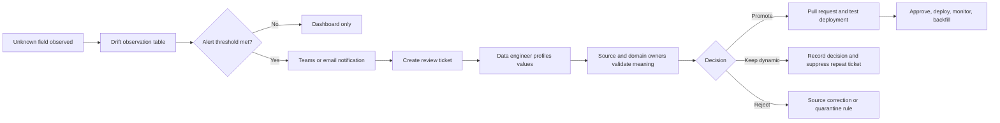

# Alert, Review, and Promotion Process

Schema drift detection is a data-plane capability. Promotion is a governed change-management decision. Production automation should notify and collect evidence, but it should not add columns automatically.

## Operating Flow



## Real Example

A controller firmware release adds `serviceCountdownHours: 120`. Typed controller ingestion continues, the value stays in `ResidualTelemetry`, and `TelemetryDriftObservations` receives:

```text
SourceType    controller
FieldPath     payload.telemetry.serviceCountdownHours
ObservedType  long
SampleValue   120
```

An alert query aggregates repeated observations. For example, notify only after 10 observations in 15 minutes rather than generating one alert per message. Production thresholds must reflect normal message volume and the desired detection delay.

## Notification Configuration

Use the `ALERT - New field needs triage` query in [11-dashboard-alert-queries.kql](../kql/11-dashboard-alert-queries.kql) as the signal. Configure Fabric Activator, a Data Activator reflex, Logic Apps, or the organization's existing monitoring platform to evaluate it on a schedule and trigger when the result contains at least one row.

Route the notification to:

- The telemetry data-operations Teams channel for acknowledgement.
- The source-system product owner for release confirmation.
- The data-governance queue or service-management system for auditable review.

The integration should create one ticket per `SourceType + FieldPath`, then update that ticket with later counts instead of opening a ticket for every evaluation.

Example notification:

```text
[MEDIUM] New telemetry field requires review

Source: controller
Field: payload.telemetry.serviceCountdownHours
Observed types: [long]
Observations: 8,212
Affected assets: 47
First seen: 2026-08-31 09:04 UTC
Last seen: 2026-08-31 09:19 UTC
Sample: 120
Typed ingestion: continuing
Dashboard: <environment dashboard link>
Review ticket: DATA-1842
```

The separate raw-to-target gap alert is high severity because it can indicate an update-policy failure. It should page data operations and start the replay runbook rather than enter the ordinary field-promotion queue.

## Responsibilities

| Role | Required action | Evidence or output |
|---|---|---|
| Data operations | Acknowledge the alert, check ingestion failures and raw-to-target gaps | Incident status and affected time range |
| Source-system owner | Confirm whether the field and type were intentionally released | Firmware/API release reference |
| Domain owner | Define meaning, unit, range, sensitivity, retention, and ownership | Approved business definition |
| Data engineer | Profile frequency, types, nulls, range, cardinality, and affected assets | Promotion recommendation |
| Data platform engineer | Implement and test DDL, stored-function revision, monitoring, and backfill | Pull request and deployment record |
| Consumer owner | Confirm naming and compatibility for reports, APIs, and OneLake consumers | Consumer acceptance |
| Change approver | Approve promotion, keep-dynamic, reject, or source-fix decision | Auditable ticket decision |

One person may fill several roles in a small team, but the source meaning and production change should not be silently inferred by the same automation that detected the field.

## Review Query

Profile the concrete example before deciding:

```kusto
RawTelemetry
| where SourceType == 'controller'
| extend Value=RawRecord.payload.telemetry.serviceCountdownHours
| summarize
    SourceRecords=count(),
    RecordsWithField=countif(isnotnull(Value)),
    AffectedAssets=dcountif(AssetId, isnotnull(Value)),
    FirstSeen=minif(EventTimestamp, isnotnull(Value)),
    LastSeen=maxif(EventTimestamp, isnotnull(Value)),
    Minimum=min(toreal(Value)),
    Maximum=max(toreal(Value)),
    ObservedTypes=make_set(gettype(Value), 8),
    Samples=make_set(Value, 10)
```

The ticket must answer:

- Was the field intentional and documented by the producer?
- Is its semantic meaning stable across source versions?
- What are its unit, valid range, null behavior, and privacy classification?
- Is one Kusto type valid for all observed values?
- Is it queried often enough to justify a physical column?
- What historical interval needs backfill?
- Which consumers must be notified before deployment?

## Promotion Decision

For `serviceCountdownHours`, assume the source owner confirms hours until scheduled service, the domain owner approves nonnegative numeric values, and profiling shows a stable numeric type. The engineer then:

1. Opens a pull request containing `.alter-merge`, the revised transform function, tests, and the bounded backfill interval.
2. Deploys to a test KQL database and compares `TransformControllerTelemetry | getschema` with the target table schema.
3. Tests both old messages without the field and new messages containing valid, null, and incompatible values.
4. Obtains source, domain, consumer, and change approval in the ticket.
5. Adds `ServiceCountdownHours:real` and deploys the revised function.
6. Monitors update-policy failures, raw-to-target completeness, and residual fields.
7. Replays only the approved raw interval using `.set-or-append`.
8. Validates row counts, values, duplicate handling, and OneLake consumers before closing the ticket.

After promotion, new messages contain `ServiceCountdownHours=120.0` and no longer contain that key in `ResidualTelemetry`.

## Other Decisions

**Keep dynamic:** use this when a field is sparse, unstable, low-value, or intended only for diagnostics. Record the reason and an expiry/review date. Add the approved path to the ticket-suppression registry, not to the transform's known-key list, because the value must remain in `ResidualTelemetry`.

**Reject or source-fix:** use this for accidental, sensitive, malformed, or contract-breaking data. Preserve raw evidence according to retention policy, define quarantine or conversion behavior, and ask the producer to correct its contract.

## Real-Time Dashboard

Create a Fabric Real-Time Dashboard connected to the same KQL database and add one tile per query section in [11-dashboard-alert-queries.kql](../kql/11-dashboard-alert-queries.kql).

Recommended layout:

| Area | Tile | Visualization | Engineer question |
|---|---|---|---|
| Ingestion health | Ingestion rate | Time chart | Is data still arriving for every source? |
| Processing health | Raw-to-target completeness | Table or column chart | Are update policies keeping up? |
| Drift triage | New fields requiring review | Sortable table | Which fields need ownership and a ticket? |
| Drift trend | Observations over time | Stacked time chart | Did a release cause a sudden spike? |
| Data quality | Conversion failures | Table | Are existing fields changing type? |
| Governance backlog | Residual fields | Table | Which fields remain unpromoted? |
| Capacity | Zone row amplification | Time chart | How many child rows does each parent produce? |

Set dashboard auto-refresh to a value appropriate for the source rate and capacity. Keep alert evaluation independent from whether an engineer has the dashboard open.

For production, add dashboard parameters for time range, source type, asset ID, and field path. Restrict raw sample values when telemetry may contain sensitive information, and apply workspace/database permissions consistently to the dashboard.
