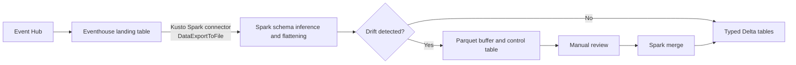
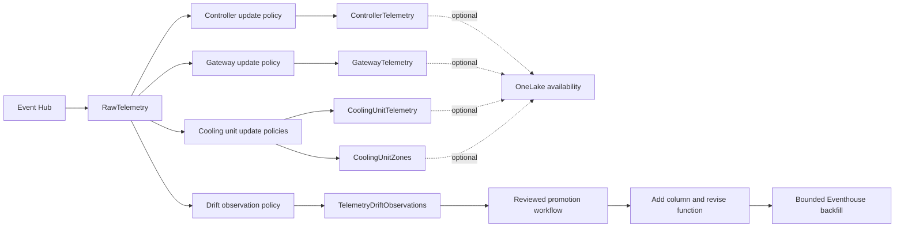
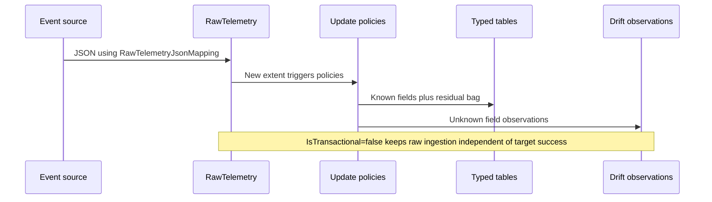

# Architecture

## Current Export-Based Pattern

The large connector read is the capacity-sensitive boundary. The buffering, watermark, and target-schema reconciliation logic exists because processing left Eventhouse.

## Eventhouse-Native Target

Every update-policy function returns a fixed schema. New telemetry keys remain in `ResidualTelemetry` and are also recorded as drift observations. No routine telemetry export is required.

## Per-Record Processing

## Design Boundaries

- Update policies perform per-ingestion transformations, not cross-row upserts.
- Drift observation is append-only; `ReviewTelemetryDrift()` aggregates duplicates.
- Variable arrays are normalized to rows. Empty arrays intentionally create no zone rows.
- Promotion is a controlled metadata operation, never an automatic reaction to one sample.